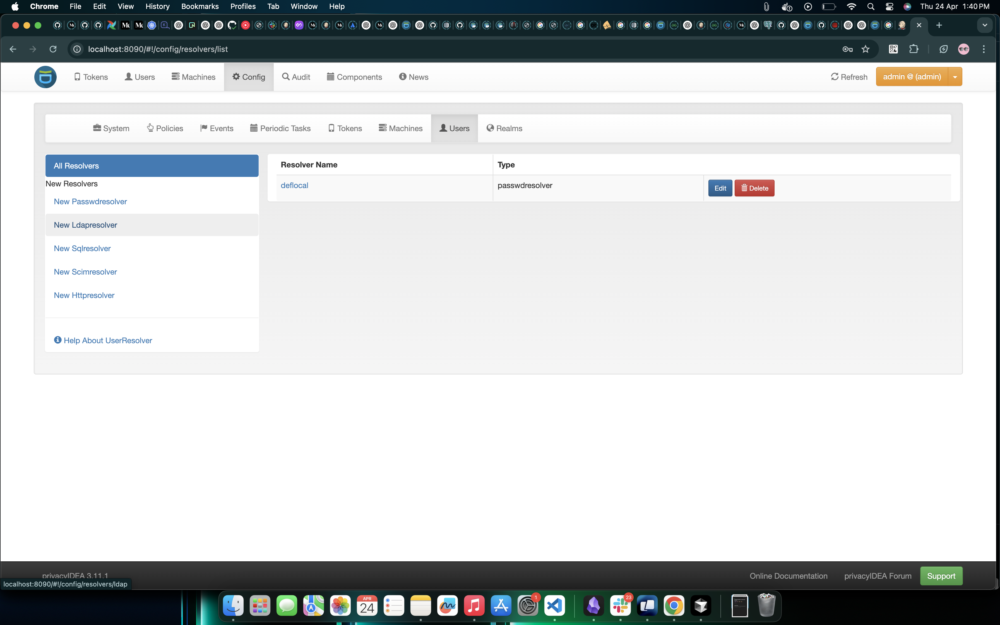
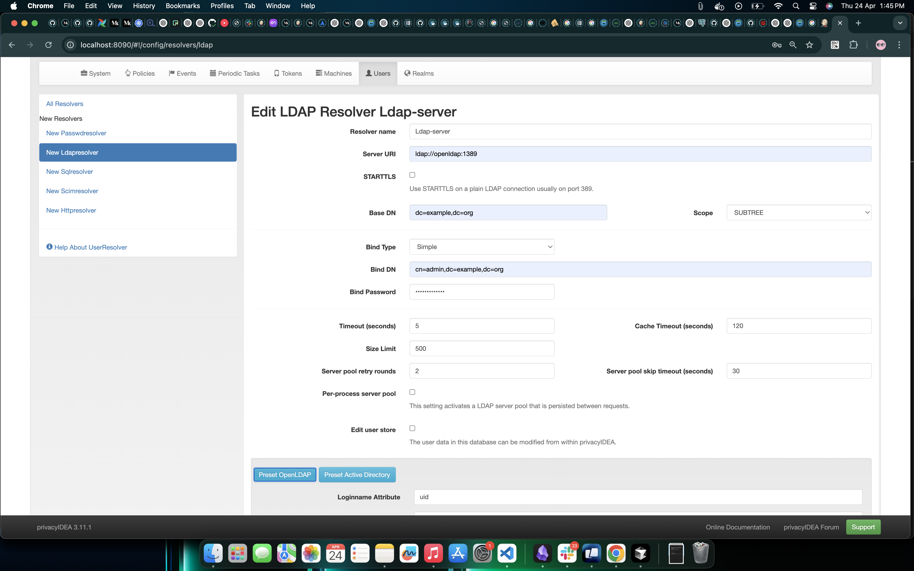
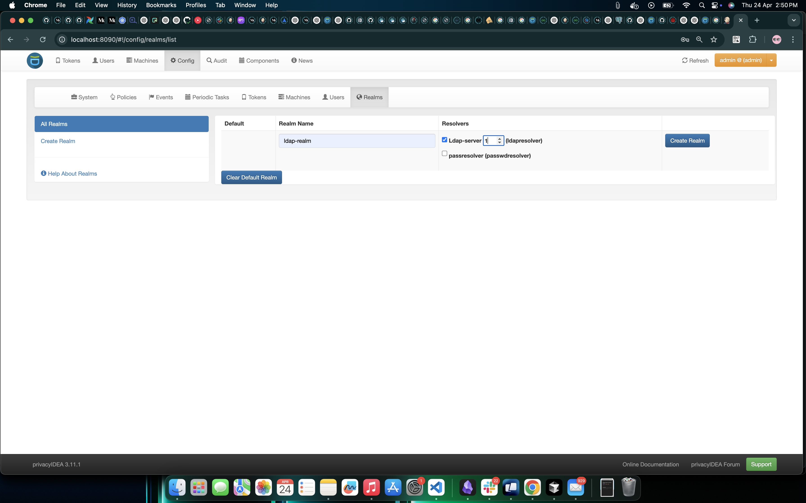
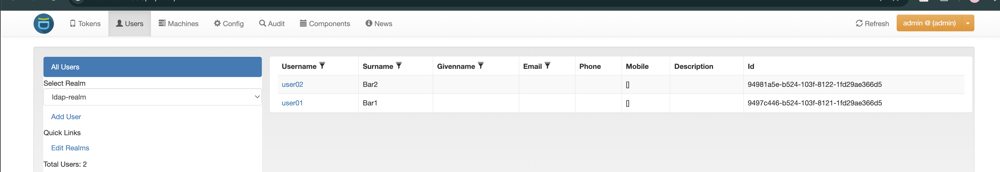
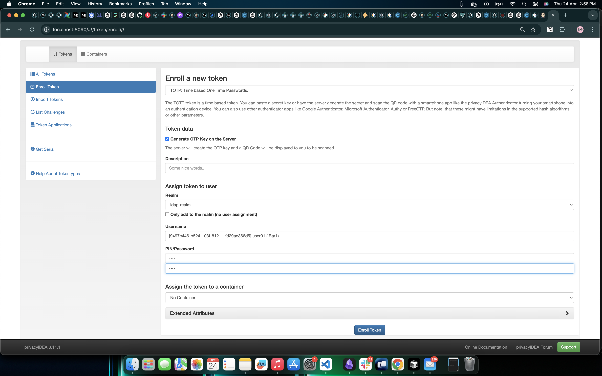
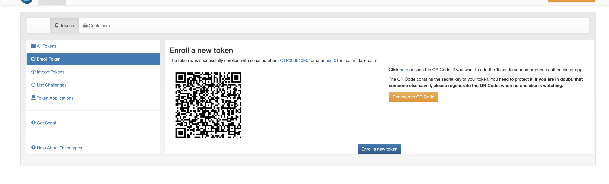

# Implementing privacyIDEA for Two-Factor Authentication

## privacyIDEA

### Overview
privacyIDEA is a modular, open-source authentication server designed for two-factor authentication (2FA).

## FreeRADIUS

### Overview
FreeRADIUS is a powerful, open-source RADIUS server used for centralized Authentication, Authorization, and Accounting (AAA). It is widely adopted in enterprise environments to manage network access securely.

### Integration with privacyIDEA
- **Authentication Request Initiation**: A client (e.g., Wi-Fi or VPN user) sends an authentication request to FreeRADIUS.
- **FreeRADIUS Processing**: FreeRADIUS uses a Perl module to forward the request to privacyIDEA’s REST API (`/validate/check`).
- **privacyIDEA Verification**: privacyIDEA verifies user credentials and second-factor authentication (e.g., OTP, U2F).
- **Response Handling**: privacyIDEA sends a success or failure response to FreeRADIUS.
- **Final Decision**: FreeRADIUS grants or denies access based on privacyIDEA's response and additional policies.

## MariaDB

### Purpose in Setup
MariaDB is the backend database used by privacyIDEA to store critical authentication data.

### Data Stored
- **User-token mappings** (e.g., TOTP, YubiKey)
- **Authentication logs** (successes and failures)
- **Policy definitions** (conditions and constraints)
- **Token secrets, serials, and metadata**
- **Audit trails** for compliance and security

## Installation Steps for privacyIDEA 2FA Stack

### Clone the repository
Clone the repository to your local machine:

```bash
git clone git@bitbucket.org:claritas/privacy-idea-mfa.git
```
### Set up the environment variables in `.env` file

Make sure to configure the environment variables in the `.env` file based on your setup.

### Start the Docker containers

Run the following command to start the services:

```bash
docker-compose up -d
```
### Now everything is working

This will bring up the following services:

- **privacyIDEA**: Available on port `8090`
- **FreeRADIUS**: Authentication on UDP ports `1812` (authentication) and `1813` (accounting)
- **OpenLDAP**: LDAP service on port `1389`
- **MariaDB**: MySQL database on port `3306`

### Initial Setup: Create Keys, Tables, and Admin User

After starting the Docker containers, follow these steps to initialize **privacyIDEA**:

#### Step-by-Step

1. **Access the privacyIDEA container**  
   Open a terminal and run:
   ```bash
   docker exec -it privacyidea bash
    ```

2. **Create the Encryption Key**
This key is used to encrypt sensitive data in the database:

   ```bash
    pi-manage create_enckey
    ```
3. **Generating GPG keys**
     ```bash
    pi-manage setup create_pgp_keys
    ```
    

4. **Create the Database Tables**  
   Initializes all required tables in the configured MariaDB database:

   ```bash
   pi-manage create_tables
    ```

5. **Generate audit key pair**    
  These keys are used to sign audit logs:
    ```bash
      pi-manage create_audit_keys
     ``` 

6. **Create an admin user**     
   This user can log into the privacyIDEA Web UI:
   ```bash
       pi-manage admin add admin
   ```
    

```
 Once complete, you can log in at http://<server-ip>:8090 with your admin credentials. 
```

## Adding a New LDAP Resolver in privacyIDEA

To allow **privacyIDEA** to authenticate users against an LDAP directory (e.g., OpenLDAP or Active Directory), you need to configure an **LDAP Resolver**.

###  Navigation Path

From the **privacyIDEA Web UI**:

`Config` → `Users` → `New LDAP Resolver`




 - Create a new LDAP Resolver




| **Field**         | **Value / Description**                                                        |
|-------------------|--------------------------------------------------------------------------------|
| **Resolver Name** | name (Choose a meaningful identifier)                                           |
| **Server URL**    | ldap://ldap-server-host:port (e.g., ldap://openldap:1389)                   |
| **Base DN**       | Defined in the LDAP_BASE variable from Docker Compose (e.g., dc=example,dc=org) |
| **Bind DN**       | Defined in the LDAP_BIND_DN or LDAP_ADMIN_USERNAME variable (e.g., cn=admin,dc=example,dc=org) |
| **Bind Password** | Same as LDAP_ADMIN_PASSWORD in Docker Compose                                   |

 - Click on `Present OpenLDAP` and `test` and `save` resolver

## Creating a Realm in privacyIDEA

After setting up your **LDAP Resolver**, the next step is to create a **Realm**. A **Realm** in **privacyIDEA** is a logical grouping that connects user resolvers (like LDAP) with the authentication and policy management framework.




 - Now go to the users page 

   - You  will see all the user listed in LDAP.





## Token Creation in privacyIDEA

### Create a Token

Follow the steps below to create a new token in **privacyIDEA**.



### Enrollment Details

- **Token Type**: TOTP (Time-based One-Time Password)
- **Realm**: ldap-realm
- **Username**: Select any existing user from the LDAP directory
- **PIN**: Set any secure PIN (this will be used along with the OTP)


### And Scan the QR code for authentication



```
It needs a static mounting for storing config file and encryption keys etc.
```
